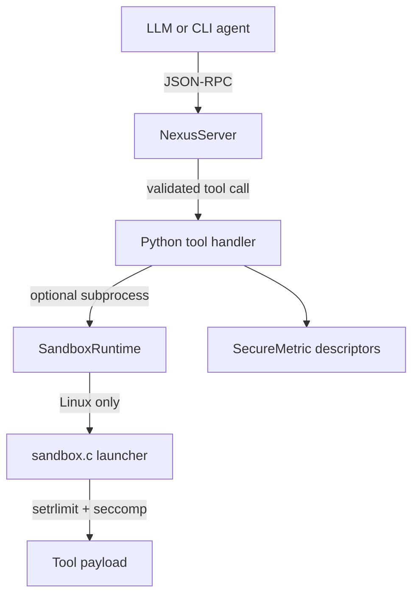

# Nexus Agent Runtime

[](https://github.com/Steve5829/nexus-agent-runtime/actions/workflows/ci.yml)
[](https://opensource.org/licenses/MIT)
[](https://www.python.org/)
[](core/sandbox/sandbox.c)

Nexus Agent Runtime is a public showcase repository for a narrow but important problem in agent systems: how to expose tool execution over a JSON-RPC/MCP-style interface while keeping the execution boundary explicit, testable, and inspectable.

This repository is intentionally scoped as an engineering prototype rather than a production sandbox. The goal is to demonstrate sound interfaces, protocol handling, descriptor-level Python internals work, and a small auditable C launcher that can evolve into a stronger runtime.

## What is in the repo

- An asynchronous MCP-style adapter with tool registration, request validation, schema checking, and stdio transport hooks.
- A C sandbox launcher prototype that applies Linux resource limits and a seccomp allowlist before handing control to a payload.
- A Python sandbox wrapper that makes the launcher callable from the runtime layer and falls back cleanly on non-Linux hosts.
- A descriptor-backed telemetry API that stores values inside the descriptor instead of the instance dictionary.
- Tests, CI, security notes, and architecture docs suitable for a public review.

## Architecture



More detail lives in [`docs/architecture.md`](docs/architecture.md).

## Why this repo is interesting

### MCP and agent tooling

`core/mcp_adapter/server.py` implements a compact JSON-RPC server that supports:

- `initialize`
- `tools/list` and `list_tools`
- `tools/call` and `call_tool`
- strict request-shape validation
- per-tool argument schema validation without external dependencies
- newline-delimited stdio serving for CLI integrations

This is enough to show protocol discipline without hiding the logic behind a framework.

### Python object model work

`sdk/secure_api.py` uses a data descriptor to validate numeric telemetry, reject deletion, and keep metric storage out of the instance dictionary via `WeakKeyDictionary`. That makes the behavior closer to the security story the old README claimed, and it demonstrates real familiarity with descriptor precedence and attribute lookup.

### Sandbox prototype

`core/sandbox/sandbox.c` is a launcher prototype, not a full container runtime. On Linux it currently demonstrates:

- `setrlimit`-based CPU, address-space, file-size, and fd caps
- a seccomp allowlist for a small command payload path
- best-effort namespace isolation where the host permits `unshare`

On macOS and other non-Linux systems, the Python wrapper falls back to direct execution so the rest of the repository remains runnable.

## Quick Start

```bash
git clone https://github.com/Steve5829/nexus-agent-runtime.git
cd nexus-agent-runtime
make install
make compile
make test
```

## Example

```python
import asyncio
import json

from core.mcp_adapter import NexusServer

server = NexusServer()

@server.tool(
    name="calculate_risk",
    description="Return a toy risk score for a numeric input.",
    input_schema={
        "type": "object",
        "properties": {"score": {"type": "number"}},
        "required": ["score"],
        "additionalProperties": False,
    },
)
async def calculate_risk(score: float):
    return {"risk_score": round(score / 100.0, 4)}

async def main():
    request = json.dumps(
        {
            "jsonrpc": "2.0",
            "id": "demo-1",
            "method": "tools/call",
            "params": {"name": "calculate_risk", "arguments": {"score": 7}},
        }
    )
    print(await server.handle_request(request))

asyncio.run(main())
```

## Repository Layout

```text
core/
  mcp_adapter/   JSON-RPC and MCP-style tool server
  sandbox/       C launcher and Python sandbox wrapper
docs/            architecture notes
docker/          container build example
sdk/             descriptor-backed telemetry API
tests/           pytest coverage for protocol and descriptor behavior
```

## Roadmap

- Add typed result envelopes for richer tool content.
- Split the Linux launcher into parent/child phases so the seccomp profile can be tighter without breaking exec.
- Add a real stdio integration example against a CLI agent.
- Add fuzz-style tests for malformed JSON-RPC payloads.

## License

MIT. See [`LICENSE`](LICENSE).
